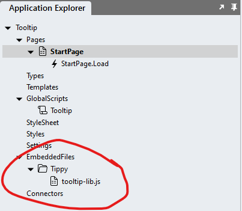
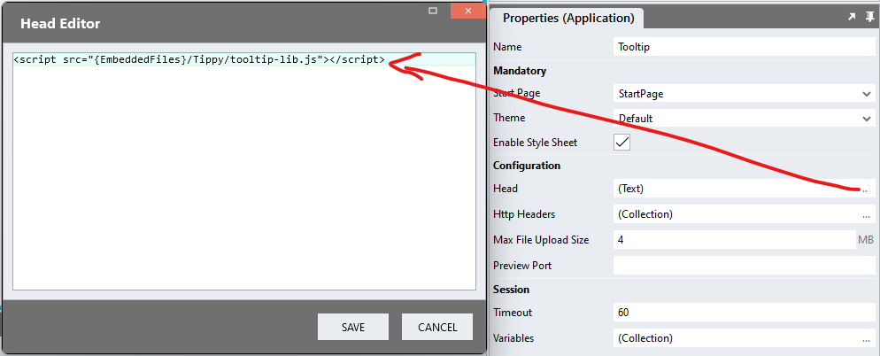

# Tooltips

A tooltip should be a brief, informative and helpful message that appears when a user interacts with an element in a user interface. Tooltips are best used to provide additional explanations or clarification, such as describing the meaning of unlabeled icons, for example. 

Tooltips are generally hidden and can be missed by users, so it is recommended that you avoid placing vital information into tooltips. When invoked, tooltips can hide other page content, so they should be as brief as possible. 

This module makes use of the [Tippy](https://atomiks.github.io/tippyjs/) tooltip library (v6.3.7). 

https://github.com/stadium-software/tooltips/assets/2085324/6e4788f8-7ace-4356-936f-24c2111d17a6

## Version
1.0 initial release

# Setup

## Application Setup
1. Check the Enable Style Sheet checkbox in the application properties

## Framework Setup
1. Create a folder called "Tippy" inside of your Embedded Files in your application
2. Drag the JS file from the framework folder of this repo [*tooltip-lib.js*](framework/tooltip-lib.js?raw=true) into that folder



3. Paste the link tag below into the *head* property of your application
```html
<script src="{EmbeddedFiles}/Tippy/tooltip-lib.js"></script>
``` 



## Global Script Setup
1. Create a Global Script called "Tooltip"
2. Add the following input parameters to the Global Script
   1. ClassName
   2. Content
   3. Options
3. Drag a JavaScript action into the script
4. Add the Javascript below into the JavaScript code property
```javascript
/* Stadium Script V1.0 */
let className = ~.Parameters.Input.ClassName;
let content = ~.Parameters.Input.Content;
let options = ~.Parameters.Input.Options;
if (!options) { 
    options = {};
}
if (typeof options === 'string') { 
    console.error("Options for '" + className + "' must be passed into the 'Tooltip' script as an object. The options were not applied");
    options = {};
}
options.content = content;
options.allowHTML = true;
tippy("." + className, options);
```

## Page Setup
1. Drag a control to the page (e.g. a *Button*)
2. Add a unique class to the control (e.g. "tooltip-button")

## Page.Load Setup
1. Drag the Global Script called "Tooltip" into the Page.Load event handler. This will cause an error message to be shown in the Stadium Designer ("Invalid script detected") that you can safely ignore. 
2. Complete the input parameters for the "Tooltip" script
   1. ClassName: The class name you just assigned to your control (e.g. "tooltip-button")
   2. Content: The content of the tooptip (you can add HTML here)
   3. Options: An object containing additional options as properties (see [Customization](https://atomiks.github.io/tippyjs/v6/customization/) and [All props](https://atomiks.github.io/tippyjs/v6/all-props/))
   Example: { followCursor: true, duration: 1, arrow: false, delay: [1000, 200], hideOnClick: 'toggle' }

